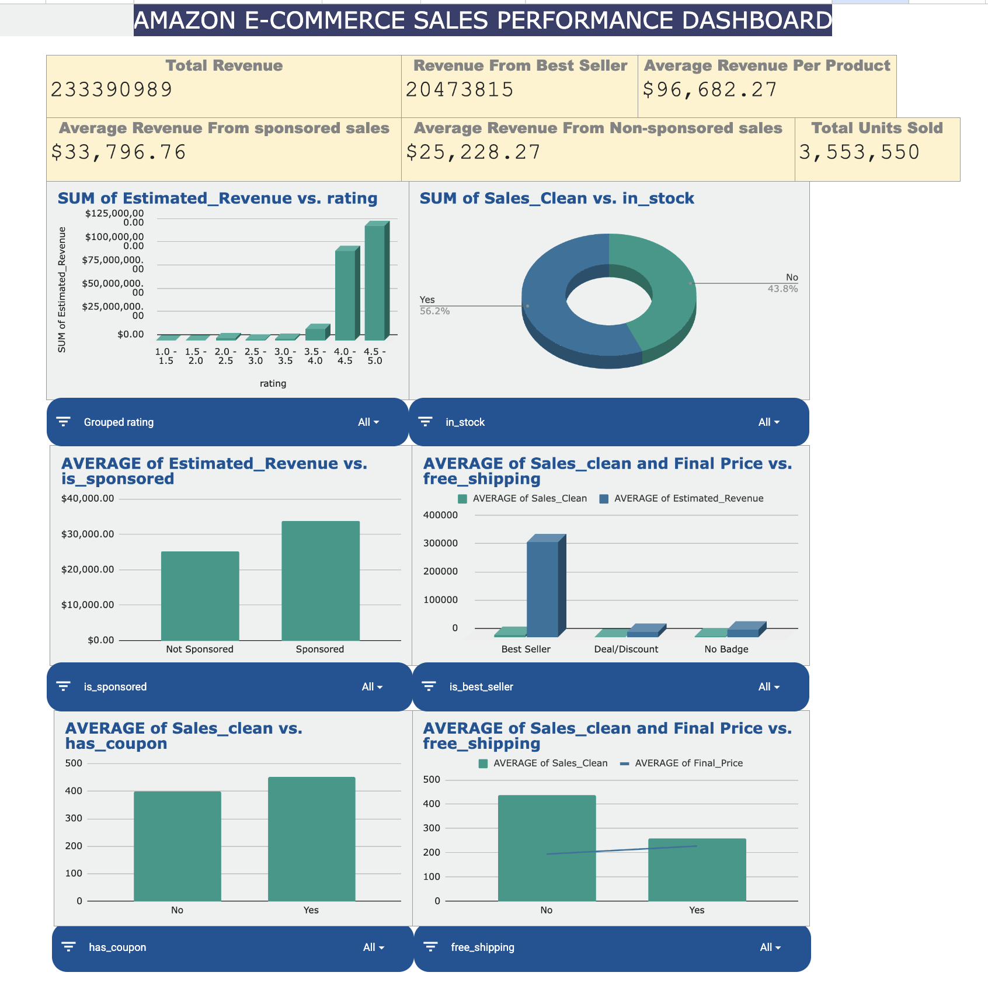

# Amazon E-Commerce Sales Performance and Profitability Analysis

## 1. Executive Summary

### Problem Statement

In the highly competitive Amazon marketplace, sellers struggle to identify the specific levers that drive revenue. With thousands of product listings, raw metrics (like price or review count) do not clearly correlate with success. Without structured analysis, sellers cannot determine if investing in "Sponsored Ads," pursuing a "Best Seller" badge, or lowering prices via "Coupons" yields the highest Return on Investment (ROI).

### Approach

We obtained a large-scale dataset of Amazon product listings. To ensure analytical agility and statistical significance, we performed a stratified sampling of the data. Using a rigorous Google Sheets-based pipeline, we cleaned the data (removing duplicates and validating pricing), engineered new features (e.g., `Estimated_Revenue`), and built a dynamic Executive Dashboard. The analysis focused on correlating attributes like Ratings, Badges, and Stock Availability with financial performance.

### Key Insights

- **Quality over Quantity:** Products with ratings between **4.5 - 5 stars** generate the highest total revenue.
- **The "Badge" Multiplier:** Items with a **"Best Seller"** badge generate approximately **5x to 10x higher revenue** than generic items.
- **Ads Drive Volume:** "Sponsored" products show significantly higher unit sales (Volume) but often lower margins, suggesting ads are a tool for visibility, not per-unit profit.

### Recommendations

- Focus on high-rating and best-seller products with more visibility and ads.
- Optimise inventory, sponsored placements, coupons, and free shipping strategies.

---

## 2. Sector & Business Context

- **Sector:** Amazon E-Commerce / Online Retail
- **Challenges:** High competition, price-sensitive customers, dependence on ratings and promotions.
- **Success Criteria:** Identify key drivers (ratings, price, stock) and provide clear dashboard insights.

---

## 3. Data Description

**Source:** Amazon Products Sales Dataset (42K+ Items – 2025)  
**Dataset Structure:**
The dataset is structured at the product level. Each row represents one Amazon product, and each column represents attributes such as price, rating, category, and sales details.

**Directory Structure:**

```
├── RawDataset/             # Original processed data (10k sample)
├── Cleaned/                # Cleaned and processed data
├── Calculations_Pivots/    # Statistical calculations and analysis
├── Dashboard/              # Dashboard-ready data
├── DataDictionary/         # Metadata and definitions
├── Documentation.pdf       # Project documentation
└── README.md               # Project documentation
```

**Specific File Info:**

- **Current File:** `RawDataset/amazon_products_sales_data.csv`
- **Size:** 10,000 records (Random Sample)
- **Period:** August 21, 2025 to August 30, 2025

---

## 4. Data Cleaning & Preparation

| Column Name           | Cleaning Action Taken                                                             |
| :-------------------- | :-------------------------------------------------------------------------------- |
| **title**             | Deleted blank rows.                                                               |
| **rating**            | Deleted rows with missing values to ensure quality data.                          |
| **Sales_Clean**       | Extracted integers (e.g., "2K+" → 2000).                                          |
| **Final_Price**       | Consolidated 3 columns; Deleted rows where price was missing.                     |
| **Estimated_Revenue** | Calculated: `Sales * Price`.                                                      |
| **is_best_seller**    | Filled blank values with "No Badge".                                              |
| **is_sponsored**      | Converted to Binary (1=Sponsored based on keyword, 0=Organic).                    |
| **in_stock**          | Created Binary Flag based on "Add to Cart" availability. Deleted original column. |
| **free_shipping**     | Created Binary Flag based on "Free Shipping" availability.                        |

---

## 5. KPI & Metric Framework

- **Revenue:** `Sales × Price`
- **Avg Rating:** Average of product ratings.
- **Sponsored %:** `Sponsored Items / Total Items`
- **Objectives:** Track sales growth, customer satisfaction, and conversion performance.

---

## 6. Dashboard Design

**Objective:** To track sales performance, revenue trends, and key drivers like ratings, sponsorship, stock, and shipping.

### Dataset Analysis



### View Structure

1.  **Top Section (KPIs):** Displays Total Revenue, Average Revenue, Units Sold, and Revenue per Unit (Sales Efficiency).
2.  **Middle Section (Charts):**
    - _Rating vs Revenue:_ Visualizes how 4.0-5.0 rated products dominate sales.
    - _Stock Availability:_ Breakdowns of sales by stock status.
3.  **Bottom Section (Comparisons):**
    - Sponsorship performance (Sponsored vs Organic).
    - Best-seller impact.
    - Coupon and Shipping comparisons.

### Filters

Interactive filters included for **Rating, Sponsorship, Stock, Coupons, and Free Shipping**.

---

## 7. Insights Summary

1.  **Focus on High-Rated Products:** Items rated 4.0-5.0 generate the majority of revenue.
2.  **Best-Sellers Win:** Investing in best-seller products maximizes sales and revenue.
3.  **Sponsored Listings:** Improve visibility and average revenue.
4.  **Stock Matters:** Maintain high stock availability to avoid revenue loss ("Out of Stock" = Risk).
5.  **Pricing Strategy:** Revenue per unit indicates strong sales efficiency; optimize accordingly.

---

## 8. Future Scope & Conclusion

**Conclusion:** The project successfully identified ratings, sponsorship, stock availability, and "Best Seller" badges as primary revenue drivers. The dashboard provides actionable strategies for optimization.

**data Needed:** Customer demographics, purchase history, and marketing spend data for deeper insights.

---

## 9. Contribution Matrix

| Team Member         | Role                 | Key Contributions                                                                           |
| :------------------ | :------------------- | :------------------------------------------------------------------------------------------ |
| **Mayank Pillai**   | **Project Lead**     | Overall Project Management, Dataset Sourcing, Cleaning, KPI Analysis, Dashboard, Reporting. |
| **Sahil Chand**     | **Dashboard Lead**   | Dashboard design and implementation.                                                        |
| **Kunal Vats**      | **Analysis Lead**    | Data analysis and insights generation.                                                      |
| **Shaurya Sharma**  | **Strategy Lead**    | Strategic recommendations and business context.                                             |
| **Praanshu Ranjan** | **PPT/Quality Lead** | Presentation and quality assurance.                                                         |
| **Anshu Yadav**     | **Data Lead**        | Data handling and processing.                                                               |

---

**Institute:** Newton School of Technology (Rishihood University)  
**Faculty Name:** Satyaki Das
